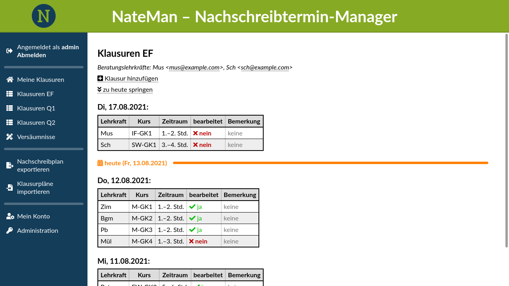

# NateMan

NateMan (**Na**chschreib**te**rmin-**Man**ager) ist eine Webanwendung zur Koordination von Klausuren gymnasialer Oberstufen. Klausurpläne können aus verschiedenen Formaten importiert oder direkt im Webinterface erstellt werden und sind anschließend öffentlich einsehbar. Über eigene Lehrerkonten können Klausuraufsichten nach einer Klausur Versäumnisse eintragen. Beratungslehrer und Oberstufenkoordinatoren können diese Bearbeitungen einsehen, bei Bedarf ändern und Atteste für Versäumnisse eintragen.



## Funktionen
* Import und Bearbeitung von Klausurlisten (aus Kurs42, bald auch UNTIS)
* administrierbares Anmeldesystem für Lehrkräfte
* Eintragung von Klausurversäumnissen und Attesten
* Versäumnislisten für Beratungslehrer
* Excel-Export von Nachschreibplänen mit automatischer Terminzuordnung
* Klausurerinnerungen an Lehrkräfte per E-Mail
* öffentlich einsehbare Klausurpläne

## Schnelle Installation

*Die schnelle Installation ist nur zum Ausprobieren geeignet und sollte nicht produktiv eingesetzt werden!*

1. Installieren Sie [Python](https://www.python.org/downloads/) und [Python-Venv](https://docs.python.org/3/library/venv.html).
    <details>
      <summary>Details</summary>
  
      Unter Linux (Debian und Derivate) installieren Sie die Pakete `python3` und `python3-venv`.\
      Unter Windows und macOS laden Sie den [Python-Installer](https://www.python.org/downloads/) herunter und führen Sie ihn aus. Python-Venv wird standardmäßig mitinstalliert.
    </details>
2. Legen Sie eine virtuelle Python-Umgebung an und betreten Sie diese.
    <details>
      <summary>Details</summary>

      **Linux/macOS:**
      ```shell
      mkdir nateman
      cd nateman
      python3 -m venv venv
      source venv/bin/activate
      ```
   
      **Windows:**
      ```dos
      mkdir nateman
      cd nateman
      py -3 -m venv venv
      venv\Scripts\activate
      ```
    </details>
3. Laden Sie das [aktuellste Installationspaket](https://github.com/nelsbrock/NateMan/releases/latest) herunter (Dateiendung: `.whl`).
4. Installation:
    ```shell
    pip install NateMan-X.Y.Z-py3-none-any.whl
    ```
5. Start:
    ```shell
    python3 -m nateman
    ```
Öffnen Sie nun den frisch installierten NateMan unter <http://localhost:8080/> und melden Sie sich mit dem Kürzel `admin` und dem Passwort `admin` an.

## Über die Entwicklung

NateMan ist im Schuljahr 2019/2020 als [Besondere Lernleistung](https://de.wikipedia.org/wiki/Besondere_Lernleistung) entstanden.

An der Entwicklung sind beteiligt:

* [Niklas Elsbrock](https://github.com/nelsbrock) (Hauptentwickler)
* [Johannes Bingel](https://github.com/Hecht376) (Exportfunktion und Excel-Importfunktion)
* Dipl.-Inform. Christian Wolf, OStR (Idee und Betreuung)